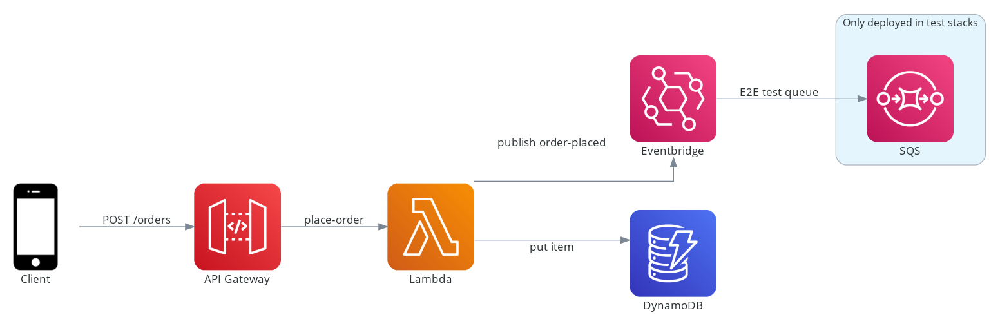

# sst-integration-testing

A small serverless application using [serverless stack (sst)](https://docs.serverless-stack.com/) demonstrating one approach to integration testing serverless applications.



## Deploying

To deploy run

```shell
> yarn install
> yarn run deploy
```

During deployment, certain cloud formation outputs will be captured (for example the deployed API Gateway endpoint) and stored as SSM parameters. These parameters are then retrieved and written to an `.env` file to be used during testing and in various helper scripts.

## Running tests

The solution contains a mix of unit and integration test. The integration test calls the API Gateway endpoint with a random order and then asserts that both the order was persisted to DynamoDB and that the `place-order` message was published to EventBridge.

To test EventBridge an auxiliary SQS queue is provisioned (but only in non production environments) which subscribes to all events in our EventBridge event bus.

To run the tests, execute

```shell
> yarn test
```

### Custom Jest Matchers

To aid in testing I have written a couple of [jest matchers](src\testing\custom-matchers\index.ts) that poll SQS or DynamoDB looking for a matching record.

```
- toHaveDynamoDBRecordMatching
- toHaveSQSMessageMatching
```

You can see examples below

```javascript
await expect({
  table: env.TABLE_NAME,
  key: { orderId: order.orderId },
}).toHaveDynamoDBRecordMatching(order)
```

```javascript
await expect({
  queueUrl: env.E2E_TEST_QUEUE_URL,
}).toHaveSQSMessageMatching({
  eventBusName: env.BUS_NAME,
  source: expect.any(String),
  'detail-type': 'order-placed',
  detail: order,
})
```

### Custom scripts and helpers

[scripts\export-env.ts](scripts/export-env.ts)

```shell
> yarn run export-env
```

This generates an `.env` from any SSM parameters its finds for the given stage and application. This will be automatically run as part of the application deploy.

An example `.env`

```
API_ENDPOINT=https://123456789.execute-api.ap-southeast-2.amazonaws.com
BUS_NAME=dev-sst-testing-order-events
E2E_TEST_QUEUE_URL=https://sqs.ap-southeast-2.amazonaws.com/123456789/dev-sst-testing-e2e-test-queue
REGION=ap-southeast-2
STAGE=dev
TABLE_NAME=dev-sst-testing-table
```

[test.http](test.http)

A `http` file that can be triggered via the [REST Client Visual Studio Code extension](https://marketplace.visualstudio.com/items?itemName=humao.rest-client) . This allows you to post a random order the to the API Gateway endpoint (read from the `.env` file). You can use this in conjunction with the script below to post and order and see the `place-order` EventBridge message.

[scripts\tail-eventbridge.ts](scripts/tail-eventbridge.ts)

```shell
> yarn run tail-eventbridge
```

This will listen to all events on the EventBridge bus and dump them to the console.

### Addtional resources

[How to include SNS and Kinesis in your e2e tests](https://theburningmonk.com/2019/09/how-to-include-sns-and-kinesis-in-your-e2e-tests)

[How to test your EventBridge integrations
](https://serverlessfirst.com/eventbridge-testing-guide/)

[Bridge Integrity — Integration Testing Strategy for EventBridge Based Serverless Architectures](https://medium.com/serverless-transformation/bridge-integrity-integration-testing-strategy-for-eventbridge-based-serverless-architectures-b73529397251)
